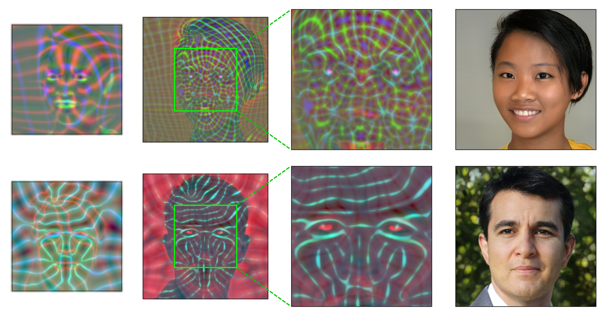
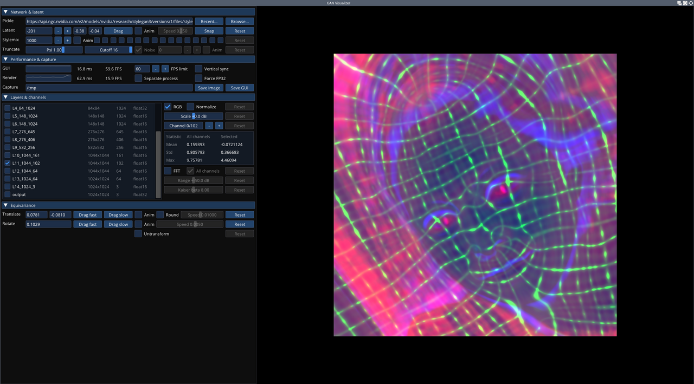
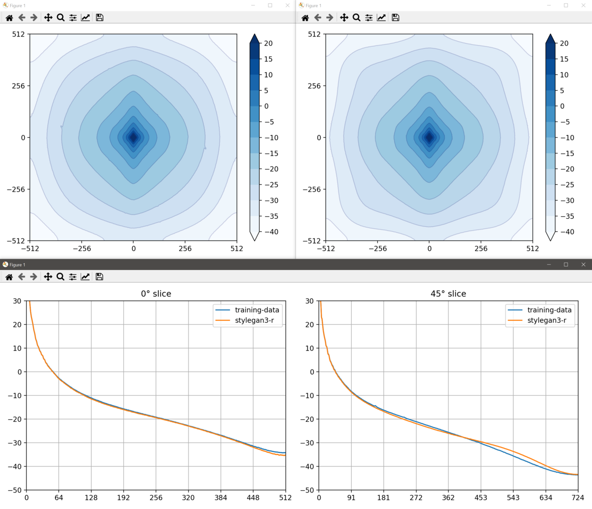

## Alias-Free Generative Adversarial Networks (StyleGAN3)<br><sub>Official PyTorch implementation of the NeurIPS 2021 paper</sub>



**Alias-Free Generative Adversarial Networks**<br>
Tero Karras, Miika Aittala, Samuli Laine, Erik H&auml;rk&ouml;nen, Janne Hellsten, Jaakko Lehtinen, Timo Aila<br>
https://nvlabs.github.io/stylegan3<br>

Abstract: *We observe that despite their hierarchical convolutional nature, the synthesis process of typical generative adversarial networks depends on absolute pixel coordinates in an unhealthy manner. This manifests itself as, e.g., detail appearing to be glued to image coordinates instead of the surfaces of depicted objects. We trace the root cause to careless signal processing that causes aliasing in the generator network. Interpreting all signals in the network as continuous, we derive generally applicable, small architectural changes that guarantee that unwanted information cannot leak into the hierarchical synthesis process. The resulting networks match the FID of StyleGAN2 but differ dramatically in their internal representations, and they are fully equivariant to translation and rotation even at subpixel scales. Our results pave the way for generative models better suited for video and animation.*

For business inquiries, please visit our website and submit the form: [NVIDIA Research Licensing](https://www.nvidia.com/en-us/research/inquiries/)

## Release notes

This repository is an updated version of [stylegan2-ada-pytorch](https://github.com/NVlabs/stylegan2-ada-pytorch), with several new features:
- Alias-free generator architecture and training configurations (`stylegan3-t`, `stylegan3-r`).
- Tools for interactive visualization (`visualizer.py`), spectral analysis (`avg_spectra.py`), and video generation (`gen_video.py`).
- Equivariance metrics (`eqt50k_int`, `eqt50k_frac`, `eqr50k`).
- General improvements: reduced memory usage, slightly faster training, bug fixes.

Compatibility:
- Compatible with old network pickles created using [stylegan2-ada](https://github.com/NVlabs/stylegan2-ada) and [stylegan2-ada-pytorch](https://github.com/NVlabs/stylegan2-ada-pytorch).  (Note: running old StyleGAN2 models on StyleGAN3 code will produce the same results as running them on stylegan2-ada/stylegan2-ada-pytorch.  To benefit from the StyleGAN3 architecture, you need to retrain.)
- Supports old StyleGAN2 training configurations, including ADA and transfer learning. See [Training configurations](./docs/configs.md) for details.
- Improved compatibility with Ampere GPUs and newer versions of PyTorch, CuDNN, etc.

## Synthetic image detection

While new generator approaches enable new media synthesis capabilities, they may also present a new challenge for AI forensics algorithms for detection and attribution of synthetic media. In collaboration with digital forensic researchers participating in DARPA's SemaFor program, we curated a synthetic image dataset that allowed the researchers to test and validate the performance of their image detectors in advance of the public release. Please see [here](https://github.com/NVlabs/stylegan3-detector) for more details.

## Additional material

- [Result videos](https://nvlabs-fi-cdn.nvidia.com/stylegan3/videos/)
- [Curated example images](https://nvlabs-fi-cdn.nvidia.com/stylegan3/images/)
- [StyleGAN3 pre-trained models](https://ngc.nvidia.com/catalog/models/nvidia:research:stylegan3) for config T (translation equiv.) and config R (translation and rotation equiv.)
  > <sub>Access individual networks via `https://api.ngc.nvidia.com/v2/models/nvidia/research/stylegan3/versions/1/files/<MODEL>`, where `<MODEL>` is one of:</sub><br>
  > <sub>`stylegan3-t-ffhq-1024x1024.pkl`, `stylegan3-t-ffhqu-1024x1024.pkl`, `stylegan3-t-ffhqu-256x256.pkl`</sub><br>
  > <sub>`stylegan3-r-ffhq-1024x1024.pkl`, `stylegan3-r-ffhqu-1024x1024.pkl`, `stylegan3-r-ffhqu-256x256.pkl`</sub><br>
  > <sub>`stylegan3-t-metfaces-1024x1024.pkl`, `stylegan3-t-metfacesu-1024x1024.pkl`</sub><br>
  > <sub>`stylegan3-r-metfaces-1024x1024.pkl`, `stylegan3-r-metfacesu-1024x1024.pkl`</sub><br>
  > <sub>`stylegan3-t-afhqv2-512x512.pkl`</sub><br>
  > <sub>`stylegan3-r-afhqv2-512x512.pkl`</sub><br>
- [StyleGAN2 pre-trained models](https://ngc.nvidia.com/catalog/models/nvidia:research:stylegan2) compatible with this codebase
  > <sub>Access individual networks via `https://api.ngc.nvidia.com/v2/models/nvidia/research/stylegan2/versions/1/files/<MODEL>`, where `<MODEL>` is one of:</sub><br>
  > <sub>`stylegan2-ffhq-1024x1024.pkl`, `stylegan2-ffhq-512x512.pkl`, `stylegan2-ffhq-256x256.pkl`</sub><br>
  > <sub>`stylegan2-ffhqu-1024x1024.pkl`, `stylegan2-ffhqu-256x256.pkl`</sub><br>
  > <sub>`stylegan2-metfaces-1024x1024.pkl`, `stylegan2-metfacesu-1024x1024.pkl`</sub><br>
  > <sub>`stylegan2-afhqv2-512x512.pkl`</sub><br>
  > <sub>`stylegan2-afhqcat-512x512.pkl`, `stylegan2-afhqdog-512x512.pkl`, `stylegan2-afhqwild-512x512.pkl`</sub><br>
  > <sub>`stylegan2-brecahad-512x512.pkl`, `stylegan2-cifar10-32x32.pkl`</sub><br>
  > <sub>`stylegan2-celebahq-256x256.pkl`, `stylegan2-lsundog-256x256.pkl`</sub><br>

## Requirements

* Linux and Windows are supported, but we recommend Linux for performance and compatibility reasons.
* 1&ndash;8 high-end NVIDIA GPUs with at least 12 GB of memory. We have done all testing and development using Tesla V100 and A100 GPUs.
* 64-bit Python 3.8 and PyTorch 1.9.0 (or later). See https://pytorch.org for PyTorch install instructions.
* CUDA toolkit 11.1 or later.  (Why is a separate CUDA toolkit installation required?  See [Troubleshooting](./docs/troubleshooting.md#why-is-cuda-toolkit-installation-necessary)).
* GCC 7 or later (Linux) or Visual Studio (Windows) compilers.  Recommended GCC version depends on CUDA version, see for example [CUDA 11.4 system requirements](https://docs.nvidia.com/cuda/archive/11.4.1/cuda-installation-guide-linux/index.html#system-requirements).
* Python libraries: see [environment.yml](./environment.yml) for exact library dependencies.  You can use the following commands with Miniconda3 to create and activate your StyleGAN3 Python environment:
  - `conda env create -f environment.yml`
  - `conda activate stylegan3`
* Docker users:
  - Ensure you have correctly installed the [NVIDIA container runtime](https://docs.docker.com/config/containers/resource_constraints/#gpu).
  - Use the [provided Dockerfile](./Dockerfile) to build an image with the required library dependencies.

The code relies heavily on custom PyTorch extensions that are compiled on the fly using NVCC. On Windows, the compilation requires Microsoft Visual Studio. We recommend installing [Visual Studio Community Edition](https://visualstudio.microsoft.com/vs/) and adding it into `PATH` using `"C:\Program Files (x86)\Microsoft Visual Studio\<VERSION>\Community\VC\Auxiliary\Build\vcvars64.bat"`.

See [Troubleshooting](./docs/troubleshooting.md) for help on common installation and run-time problems.

## Getting started

Pre-trained networks are stored as `*.pkl` files that can be referenced using local filenames or URLs:

```.bash
# Generate an image using pre-trained AFHQv2 model ("Ours" in Figure 1, left).
python gen_images.py --outdir=out --trunc=1 --seeds=2 \
    --network=https://api.ngc.nvidia.com/v2/models/nvidia/research/stylegan3/versions/1/files/stylegan3-r-afhqv2-512x512.pkl

# Render a 4x2 grid of interpolations for seeds 0 through 31.
python gen_video.py --output=lerp.mp4 --trunc=1 --seeds=0-31 --grid=4x2 \
    --network=https://api.ngc.nvidia.com/v2/models/nvidia/research/stylegan3/versions/1/files/stylegan3-r-afhqv2-512x512.pkl
```

Outputs from the above commands are placed under `out/*.png`, controlled by `--outdir`. Downloaded network pickles are cached under `$HOME/.cache/dnnlib`, which can be overridden by setting the `DNNLIB_CACHE_DIR` environment variable. The default PyTorch extension build directory is `$HOME/.cache/torch_extensions`, which can be overridden by setting `TORCH_EXTENSIONS_DIR`.

**Docker**: You can run the above curated image example using Docker as follows:

```.bash
# Build the stylegan3:latest image
docker build --tag stylegan3 .

# Run the gen_images.py script using Docker:
docker run --gpus all -it --rm --user $(id -u):$(id -g) \
    -v `pwd`:/scratch --workdir /scratch -e HOME=/scratch \
    stylegan3 \
    python gen_images.py --outdir=out --trunc=1 --seeds=2 \
         --network=https://api.ngc.nvidia.com/v2/models/nvidia/research/stylegan3/versions/1/files/stylegan3-r-afhqv2-512x512.pkl
```

Note: The Docker image requires NVIDIA driver release `r470` or later.

The `docker run` invocation may look daunting, so let's unpack its contents here:

- `--gpus all -it --rm --user $(id -u):$(id -g)`: with all GPUs enabled, run an interactive session with current user's UID/GID to avoid Docker writing files as root.
- ``-v `pwd`:/scratch --workdir /scratch``: mount current running dir (e.g., the top of this git repo on your host machine) to `/scratch` in the container and use that as the current working dir.
- `-e HOME=/scratch`: let PyTorch and StyleGAN3 code know where to cache temporary files such as pre-trained models and custom PyTorch extension build results. Note: if you want more fine-grained control, you can instead set `TORCH_EXTENSIONS_DIR` (for custom extensions build dir) and `DNNLIB_CACHE_DIR` (for pre-trained model download cache). You want these cache dirs to reside on persistent volumes so that their contents are retained across multiple `docker run` invocations.

## Interactive visualization

This release contains an interactive model visualization tool that can be used to explore various characteristics of a trained model.  To start it, run:

```.bash
python visualizer.py
```

<a href="./docs/visualizer_screen0.png"></img></a>

## Using networks from Python

You can use pre-trained networks in your own Python code as follows:

```.python
with open('ffhq.pkl', 'rb') as f:
    G = pickle.load(f)['G_ema'].cuda()  # torch.nn.Module
z = torch.randn([1, G.z_dim]).cuda()    # latent codes
c = None                                # class labels (not used in this example)
img = G(z, c)                           # NCHW, float32, dynamic range [-1, +1], no truncation
```

The above code requires `torch_utils` and `dnnlib` to be accessible via `PYTHONPATH`. It does not need source code for the networks themselves &mdash; their class definitions are loaded from the pickle via `torch_utils.persistence`.

The pickle contains three networks. `'G'` and `'D'` are instantaneous snapshots taken during training, and `'G_ema'` represents a moving average of the generator weights over several training steps. The networks are regular instances of `torch.nn.Module`, with all of their parameters and buffers placed on the CPU at import and gradient computation disabled by default.

The generator consists of two submodules, `G.mapping` and `G.synthesis`, that can be executed separately. They also support various additional options:

```.python
w = G.mapping(z, c, truncation_psi=0.5, truncation_cutoff=8)
img = G.synthesis(w, noise_mode='const', force_fp32=True)
```

Please refer to [`gen_images.py`](./gen_images.py) for complete code example.

## Preparing datasets

Datasets are stored as uncompressed ZIP archives containing uncompressed PNG files and a metadata file `dataset.json` for labels. Custom datasets can be created from a folder containing images; see [`python dataset_tool.py --help`](./docs/dataset-tool-help.txt) for more information. Alternatively, the folder can also be used directly as a dataset, without running it through `dataset_tool.py` first, but doing so may lead to suboptimal performance.

**FFHQ**: Download the [Flickr-Faces-HQ dataset](https://github.com/NVlabs/ffhq-dataset) as 1024x1024 images and create a zip archive using `dataset_tool.py`:

```.bash
# Original 1024x1024 resolution.
python dataset_tool.py --source=/tmp/images1024x1024 --dest=~/datasets/ffhq-1024x1024.zip

# Scaled down 256x256 resolution.
python dataset_tool.py --source=/tmp/images1024x1024 --dest=~/datasets/ffhq-256x256.zip \
    --resolution=256x256
```

See the [FFHQ README](https://github.com/NVlabs/ffhq-dataset) for information on how to obtain the unaligned FFHQ dataset images. Use the same steps as above to create a ZIP archive for training and validation.

**MetFaces**: Download the [MetFaces dataset](https://github.com/NVlabs/metfaces-dataset) and create a ZIP archive:

```.bash
python dataset_tool.py --source=~/downloads/metfaces/images --dest=~/datasets/metfaces-1024x1024.zip
```

See the [MetFaces README](https://github.com/NVlabs/metfaces-dataset) for information on how to obtain the unaligned MetFaces dataset images. Use the same steps as above to create a ZIP archive for training and validation.

**AFHQv2**: Download the [AFHQv2 dataset](https://github.com/clovaai/stargan-v2/blob/master/README.md#animal-faces-hq-dataset-afhq) and create a ZIP archive:

```.bash
python dataset_tool.py --source=~/downloads/afhqv2 --dest=~/datasets/afhqv2-512x512.zip
```

Note that the above command creates a single combined dataset using all images of all three classes (cats, dogs, and wild animals), matching the setup used in the StyleGAN3 paper. Alternatively, you can also create a separate dataset for each class:

```.bash
python dataset_tool.py --source=~/downloads/afhqv2/train/cat --dest=~/datasets/afhqv2cat-512x512.zip
python dataset_tool.py --source=~/downloads/afhqv2/train/dog --dest=~/datasets/afhqv2dog-512x512.zip
python dataset_tool.py --source=~/downloads/afhqv2/train/wild --dest=~/datasets/afhqv2wild-512x512.zip
```

## Training

You can train new networks using `train.py`. For example:

```.bash
# Train StyleGAN3-T for AFHQv2 using 8 GPUs.
python train.py --outdir=~/training-runs --cfg=stylegan3-t --data=~/datasets/afhqv2-512x512.zip \
    --gpus=8 --batch=32 --gamma=8.2 --mirror=1

# Fine-tune StyleGAN3-R for MetFaces-U using 1 GPU, starting from the pre-trained FFHQ-U pickle.
python train.py --outdir=~/training-runs --cfg=stylegan3-r --data=~/datasets/metfacesu-1024x1024.zip \
    --gpus=8 --batch=32 --gamma=6.6 --mirror=1 --kimg=5000 --snap=5 \
    --resume=https://api.ngc.nvidia.com/v2/models/nvidia/research/stylegan3/versions/1/files/stylegan3-r-ffhqu-1024x1024.pkl

# Train StyleGAN2 for FFHQ at 1024x1024 resolution using 8 GPUs.
python train.py --outdir=~/training-runs --cfg=stylegan2 --data=~/datasets/ffhq-1024x1024.zip \
    --gpus=8 --batch=32 --gamma=10 --mirror=1 --aug=noaug
```

Note that the result quality and training time depend heavily on the exact set of options. The most important ones (`--gpus`, `--batch`, and `--gamma`) must be specified explicitly, and they should be selected with care. See [`python train.py --help`](./docs/train-help.txt) for the full list of options and [Training configurations](./docs/configs.md) for general guidelines &amp; recommendations, along with the expected training speed &amp; memory usage in different scenarios.

The results of each training run are saved to a newly created directory, for example `~/training-runs/00000-stylegan3-t-afhqv2-512x512-gpus8-batch32-gamma8.2`. The training loop exports network pickles (`network-snapshot-<KIMG>.pkl`) and random image grids (`fakes<KIMG>.png`) at regular intervals (controlled by `--snap`). For each exported pickle, it evaluates FID (controlled by `--metrics`) and logs the result in `metric-fid50k_full.jsonl`. It also records various statistics in `training_stats.jsonl`, as well as `*.tfevents` if TensorBoard is installed.

## Quality metrics

By default, `train.py` automatically computes FID for each network pickle exported during training. We recommend inspecting `metric-fid50k_full.jsonl` (or TensorBoard) at regular intervals to monitor the training progress. When desired, the automatic computation can be disabled with `--metrics=none` to speed up the training slightly.

Additional quality metrics can also be computed after the training:

```.bash
# Previous training run: look up options automatically, save result to JSONL file.
python calc_metrics.py --metrics=eqt50k_int,eqr50k \
    --network=~/training-runs/00000-stylegan3-r-mydataset/network-snapshot-000000.pkl

# Pre-trained network pickle: specify dataset explicitly, print result to stdout.
python calc_metrics.py --metrics=fid50k_full --data=~/datasets/ffhq-1024x1024.zip --mirror=1 \
    --network=https://api.ngc.nvidia.com/v2/models/nvidia/research/stylegan3/versions/1/files/stylegan3-t-ffhq-1024x1024.pkl
```

The first example looks up the training configuration and performs the same operation as if `--metrics=eqt50k_int,eqr50k` had been specified during training. The second example downloads a pre-trained network pickle, in which case the values of `--data` and `--mirror` must be specified explicitly.

Note that the metrics can be quite expensive to compute (up to 1h), and many of them have an additional one-off cost for each new dataset (up to 30min). Also note that the evaluation is done using a different random seed each time, so the results will vary if the same metric is computed multiple times.

Recommended metrics:
* `fid50k_full`: Fr&eacute;chet inception distance<sup>[1]</sup> against the full dataset.
* `kid50k_full`: Kernel inception distance<sup>[2]</sup> against the full dataset.
* `pr50k3_full`: Precision and recall<sup>[3]</sup> againt the full dataset.
* `ppl2_wend`: Perceptual path length<sup>[4]</sup> in W, endpoints, full image.
* `eqt50k_int`: Equivariance<sup>[5]</sup> w.r.t. integer translation (EQ-T).
* `eqt50k_frac`: Equivariance w.r.t. fractional translation (EQ-T<sub>frac</sub>).
* `eqr50k`: Equivariance w.r.t. rotation (EQ-R).

Legacy metrics:
* `fid50k`: Fr&eacute;chet inception distance against 50k real images.
* `kid50k`: Kernel inception distance against 50k real images.
* `pr50k3`: Precision and recall against 50k real images.
* `is50k`: Inception score<sup>[6]</sup> for CIFAR-10.

References:
1. [GANs Trained by a Two Time-Scale Update Rule Converge to a Local Nash Equilibrium](https://arxiv.org/abs/1706.08500), Heusel et al. 2017
2. [Demystifying MMD GANs](https://arxiv.org/abs/1801.01401), Bi&nacute;kowski et al. 2018
3. [Improved Precision and Recall Metric for Assessing Generative Models](https://arxiv.org/abs/1904.06991), Kynk&auml;&auml;nniemi et al. 2019
4. [A Style-Based Generator Architecture for Generative Adversarial Networks](https://arxiv.org/abs/1812.04948), Karras et al. 2018
5. [Alias-Free Generative Adversarial Networks](https://nvlabs.github.io/stylegan3), Karras et al. 2021
6. [Improved Techniques for Training GANs](https://arxiv.org/abs/1606.03498), Salimans et al. 2016

## Spectral analysis

The easiest way to inspect the spectral properties of a given generator is to use the built-in FFT mode in `visualizer.py`. In addition, you can visualize average 2D power spectra (Appendix A, Figure 15) as follows:

```.bash
# Calculate dataset mean and std, needed in subsequent steps.
python avg_spectra.py stats --source=~/datasets/ffhq-1024x1024.zip

# Calculate average spectrum for the training data.
python avg_spectra.py calc --source=~/datasets/ffhq-1024x1024.zip \
    --dest=tmp/training-data.npz --mean=112.684 --std=69.509

# Calculate average spectrum for a pre-trained generator.
python avg_spectra.py calc \
    --source=https://api.ngc.nvidia.com/v2/models/nvidia/research/stylegan3/versions/1/files/stylegan3-r-ffhq-1024x1024.pkl \
    --dest=tmp/stylegan3-r.npz --mean=112.684 --std=69.509 --num=70000

# Display results.
python avg_spectra.py heatmap tmp/training-data.npz
python avg_spectra.py heatmap tmp/stylegan3-r.npz
python avg_spectra.py slices tmp/training-data.npz tmp/stylegan3-r.npz
```

<a href="./docs/avg_spectra_screen0.png"></img></a>

## License

Copyright &copy; 2021, NVIDIA Corporation & affiliates. All rights reserved.

This work is made available under the [Nvidia Source Code License](https://github.com/NVlabs/stylegan3/blob/main/LICENSE.txt).

## Citation

```
@inproceedings{Karras2021,
  author = {Tero Karras and Miika Aittala and Samuli Laine and Erik H\"ark\"onen and Janne Hellsten and Jaakko Lehtinen and Timo Aila},
  title = {Alias-Free Generative Adversarial Networks},
  booktitle = {Proc. NeurIPS},
  year = {2021}
}
```

## Development

This is a research reference implementation and is treated as a one-time code drop. As such, we do not accept outside code contributions in the form of pull requests.

## Acknowledgements

We thank David Luebke, Ming-Yu Liu, Koki Nagano, Tuomas Kynk&auml;&auml;nniemi, and Timo Viitanen for reviewing early drafts and helpful suggestions. Fr&eacute;do Durand for early discussions. Tero Kuosmanen for maintaining our compute infrastructure. AFHQ authors for an updated version of their dataset. Getty Images for the training images in the Beaches dataset. We did not receive external funding or additional revenues for this project.
